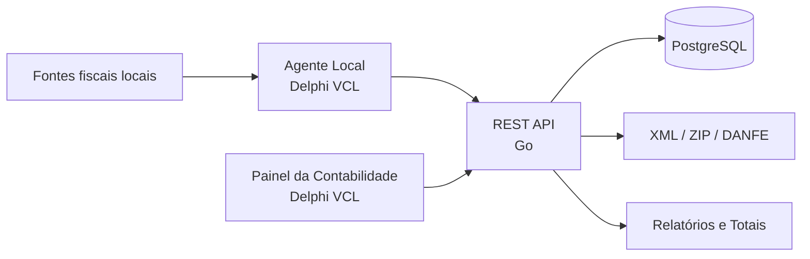
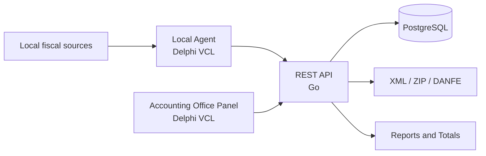

# ConferirArquivo

**Fiscal document synchronization, accounting support and integration platform**


> **Public showcase of a commercial/internal project.** The production source code is private. This repository presents the architecture, technologies and engineering challenges without exposing proprietary code, credentials, customer data or internal infrastructure.

---

## 🇧🇷 Português

### Sobre o projeto

O **ConferirArquivo** é uma solução voltada à automação do fluxo de documentos fiscais entre instalações dos clientes, uma API central e o ambiente operacional da contabilidade.

A plataforma combina aplicações desktop em **Delphi VCL** com uma API em **Go**, permitindo sincronizar, consultar, organizar e disponibilizar documentos fiscais de forma centralizada.

O projeto foi estruturado para trabalhar com cenários reais de operação, incluindo múltiplas empresas, autenticação, isolamento de dados por cliente, filas de sincronização, relatórios fiscais e automações para o escritório contábil.

### Principais recursos

- Sincronização de documentos fiscais a partir de um agente local.
- Tratamento de **NF-e (modelo 55)** e **NFC-e (modelo 65)**.
- Separação entre documentos de entrada e saída.
- Fila local de sincronização e registro de eventos/logs.
- API REST central para integração entre agentes e aplicações.
- Autenticação de usuários e autenticação específica para integrações.
- Isolamento de documentos e consultas por cliente/empresa.
- Consulta de totais fiscais por período e por tipo de documento.
- Separação entre documentos válidos e cancelados nos relatórios.
- Download de XML individual ou múltiplos XMLs em arquivo ZIP.
- Geração/disponibilização de **DANFE / DANFCe em PDF**.
- Consulta estruturada de informações fiscais via API.
- Painel desktop para operação do escritório/contabilidade.
- Configuração de envio contábil e SMTP.
- Automação de preparação e envio de arquivos por competência/período.

### Arquitetura



### Componentes

#### Agente Local

Aplicação Windows desenvolvida em **Delphi VCL**, responsável pela integração com as fontes fiscais locais, organização da fila e sincronização com a plataforma central.

**Tecnologias e conceitos:**

- Delphi VCL
- FireDAC
- processamento local de documentos fiscais
- fila de sincronização
- configuração local
- logs operacionais
- execução em modo desktop/tray

#### API central

Backend desenvolvido em **Go**, responsável pela camada HTTP, autenticação, regras de acesso, persistência e serviços de integração.

**Stack principal:**

- Go 1.23
- `chi` para roteamento HTTP
- PostgreSQL
- `pgx` para acesso ao banco
- APIs REST
- autenticação baseada em JWT e tokens de integração

#### Painel da Contabilidade

Aplicação desktop em **Delphi VCL** voltada à operação administrativa e contábil.

Entre as responsabilidades estão a consulta das informações sincronizadas, configuração de parâmetros contábeis, configuração SMTP e apoio ao fluxo de envio de documentos.

### Fluxo simplificado

```text
Sistema/BD do cliente
        ↓
Agente ConferirArquivo
        ↓
Sincronização segura
        ↓
API central
        ↓
PostgreSQL
        ↓
Painel / relatórios / downloads / automações contábeis
```

### Desafios de engenharia

Alguns dos pontos trabalhados neste projeto incluem:

- integração entre aplicações desktop legadas e serviços modernos;
- sincronização confiável de dados fiscais;
- modelagem de entrada, saída e diferentes modelos de documento;
- isolamento de dados entre empresas;
- autenticação distinta para usuários e integrações de sistema;
- processamento e entrega de múltiplos XMLs;
- geração e disponibilização de documentos auxiliares em PDF;
- relatórios consolidados por período;
- automação de rotinas recorrentes da contabilidade;
- manutenção de compatibilidade com ambientes Windows utilizados pelos clientes.

### Tecnologias

| Camada | Tecnologias |
|---|---|
| Desktop | Delphi, VCL, FireDAC |
| Backend | Go, REST API, chi |
| Banco central | PostgreSQL, pgx |
| Fiscal | NF-e, NFC-e, XML, DANFE, DANFCe |
| Integração | JSON, HTTP, JWT, integration tokens |
| Operação | SMTP, ZIP, logs, filas de sincronização |

### Sobre este repositório

Este repositório é exclusivamente um **showcase técnico**.

Por se tratar de uma solução comercial/interna, não são publicados aqui:

- código-fonte de produção;
- credenciais e tokens;
- endpoints ou infraestrutura interna;
- configurações de clientes;
- dados fiscais reais;
- regras proprietárias específicas da empresa.

---

## 🇺🇸 English

### About the project

**ConferirArquivo** is a platform designed to automate fiscal-document workflows between customer installations, a centralized API and the accounting-office environment.

The solution combines **Delphi VCL desktop applications** with a **Go backend**, centralizing synchronization, querying, organization and delivery of fiscal documents.

It was designed for real business scenarios involving multiple companies, authentication, tenant-aware access, synchronization queues, fiscal reporting and accounting automation.

### Key features

- Local fiscal-document synchronization agent.
- **NF-e (model 55)** and **NFC-e (model 65)** processing.
- Incoming and outgoing document classification.
- Local synchronization queue and operational logging.
- Central REST API for application and system integration.
- User authentication and dedicated integration authentication.
- Customer-scoped document access and data isolation.
- Fiscal totals by period and document type.
- Valid vs. cancelled document reporting.
- Individual XML and multi-document ZIP downloads.
- **DANFE / DANFCe PDF** delivery.
- Structured fiscal-document information through the API.
- Accounting-office desktop panel.
- SMTP and accounting-delivery configuration.
- Period-based accounting file preparation and delivery automation.

### Architecture



### Technology stack

| Layer | Technologies |
|---|---|
| Desktop | Delphi, VCL, FireDAC |
| Backend | Go, REST API, chi |
| Central database | PostgreSQL, pgx |
| Fiscal domain | NF-e, NFC-e, XML, DANFE, DANFCe |
| Integration | JSON, HTTP, JWT, integration tokens |
| Operations | SMTP, ZIP, logging, synchronization queues |

### Engineering focus

The project includes engineering work around:

- bridging desktop business software with modern backend services;
- reliable fiscal-data synchronization;
- multi-company data isolation;
- document classification and reconciliation;
- secure user and system integrations;
- bulk fiscal-document delivery;
- accounting reports and recurring operational automation;
- Windows desktop compatibility in customer environments.

### Source-code availability

The production repository is private because this is a **commercial/internal business project**.

This public repository intentionally contains only portfolio-safe technical information and does not expose proprietary implementation details, credentials, customer data or production infrastructure.

---

### Portfolio

Developed as part of a broader portfolio focused on **business systems, ERP/POS integrations, desktop software, APIs and operational automation**.
